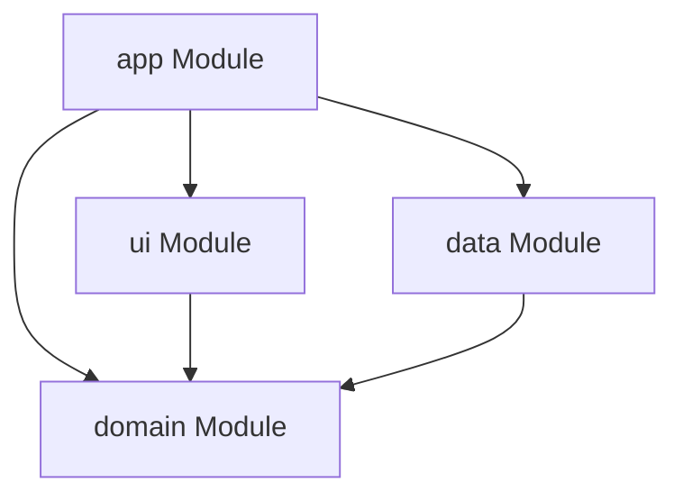

# Aiyo - Technical Architecture & Developer Guide

Aiyo is an AI chat application for Android that enables users to connect with hundreds of models by utilizing their own OpenRouter API key. This document serves as a comprehensive developer reference detailing the architecture, module roles, database configuration, and design systems.

---

## 1. Project Organization & Gradle Modules

The project is modularized into four distinct layers (modules) adhering to Clean Architecture principles:



### 📂 `app/` (Application Entry, Navigation, & Hilt Injection)
This module binds the other modules together, establishes Dependency Injection, and manages application routing.
*   **[AiyoApp.kt](file:///c:/Users/siddi/Desktop/coding/aiyo/app/src/main/java/com/beradeep/aiyo/AiyoApp.kt)**: The main Application entry annotated with `@HiltAndroidApp` to initialize Dependency Injection.
*   **[MainActivity.kt](file:///c:/Users/siddi/Desktop/coding/aiyo/app/src/main/java/com/beradeep/aiyo/MainActivity.kt)**: The launcher Activity. Resolves light/dark theme preference from `SettingRepository` and hosts the root navigation structure.
*   **[nav/AiyoNavHost.kt](file:///c:/Users/siddi/Desktop/coding/aiyo/app/src/main/java/com/beradeep/aiyo/nav/AiyoNavHost.kt)**: Employs standard Jetpack Compose NavHost. Routes between:
    *   `Screen.ChatScreen` (associates `ChatViewModelImpl` from DI)
    *   `Screen.SettingsScreen` (associates `SettingsViewModelImpl` from DI)
*   **`di/`**: Hilt bindings declaring how models, databases, and clients are supplied across the codebase.

---

### 📂 `ui/` (Jetpack Compose UI & MVVM/MVI Presentation Layer)
This module handles all styling and screens. It follows a unidirectional data flow (MVI) mapping events to state changes.
*   **Basics Library (`ui/src/main/java/com/beradeep/aiyo/ui/basics/`)**:
    *   Contains custom wrapped basic widgets (like `Button`, `IconButton`, `Text`, `Tooltip`, `Scaffold`, and `TopBar`).
    *   *Guideline*: UI screens must use these components rather than calling Material 3 APIs directly, assuring visual consistency.
*   **Chat Screen (`ui/src/main/java/com/beradeep/aiyo/ui/screens/chat/`)**:
    *   `ChatScreen.kt`: Handles the rendering of bubbles, sidebar threads list, input prompts, web search toggles, and reasoning effort controls.
    *   `ChatViewModel.kt`: Processes `ChatUiEvent` events and streams responses from the API, updates lists of loaded models, and handles cancellation or thread editing.
    *   `ChatUiState.kt` / `ChatUiEvent.kt`: State holders representing loading indicators, active model name, lists of bubbles, and API token flags.
*   **Settings Screen (`ui/src/main/java/com/beradeep/aiyo/ui/screens/settings/`)**:
    *   `SettingsScreen.kt` & `SettingsViewModel.kt`: Allows users to input keys, configure text sizes, and change themes.

---

### 📂 `domain/` (Business Entities & Repository Specifications)
This module contains pure Kotlin code (independent of Android frameworks). It models core concepts and interfaces.
*   **`model/`**:
    *   `Conversation`: Represents a thread containing id, title, timestamps, active model, and starring flag.
    *   `Message`: Stores specific message elements (id, role, text content, reasoning text, and timestamps).
    *   `Model`: Exposes OpenAI/OpenRouter engine traits (id, name, description, context length, pricing).
*   **`repository/`**:
    *   Declares contracts for repositories (`ChatRepository`, `ApiKeyRepository`, `SettingRepository`, `ModelRepository`).

---

### 📂 `data/` (Room DB, Key-Value Preferences, & OpenRouter Network Client)
This module implements the repository interfaces defined in the domain layer using local or network data sources.
*   **Local Caches (`local/`)**:
    *   `kv/`: Leverages MMKV key-value store to persist settings (e.g. font size, theme choice, and api key).
    *   `db/`: Sets up the Room SQLite instance (`AiyoDatabase.kt`).
        *   `dao/ConversationDao` & `dao/MessageDao`: Declares database queries (Insert, Delete, Star, Fetch flows).
        *   `entity/ConversationEntity` & `entity/MessageEntity`: SQL representations of model classes.
*   **Network Client (`remote/`)**:
    *   `ApiClientImpl.kt`: Directs API calls to the OpenRouter gateway. It instantiates the official `openai-kotlin` client pointing its host parameter to `https://openrouter.ai/api/v1/`.
*   **Mappers (`Mappers.kt`)**:
    *   Contains extension functions to map database entities to domain models (e.g., `MessageEntity.toMessage()`).

---

## 2. Core Operational Flows

### A. Message Streaming & Chat Pipeline
When the user sends a message in `ChatScreen`:
```
[User Presses Send] 
       ↓
ChatUiEvent.OnMessageSend is fired
       ↓
ChatViewModel updates State to UI (loading, adds message bubble)
       ↓
Saves User Message to Room database via ChatRepository
       ↓
Calls ApiClient to stream response in a Coroutine
       ↓
Retrieves chunks, handles reasoning logs if present, and updates UI state dynamically
       ↓
Completes flow: Saves final AI response to database
```

### B. Theme Management
`MainActivity` listens to settings dynamically:
1. Employs `SettingRepository.getThemeType()` which reads configuration from the key-value store.
2. Evaluates `ThemeType.System` (fallback to system dark/light), `ThemeType.Light`, or `ThemeType.Dark`.
3. Wraps navigation hierarchy in `AiyoTheme(isDarkTheme)`.
